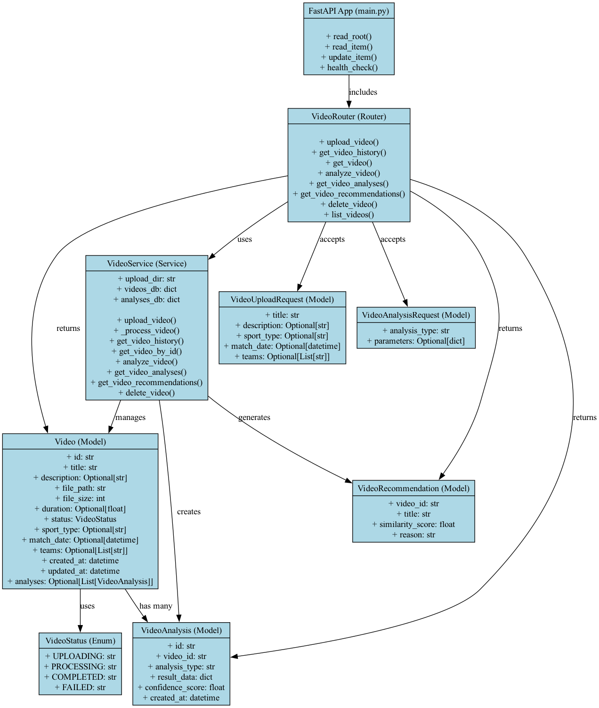

# Sports Vision AI API



> 위 이미지는 프로젝트의 주요 클래스(모델, 서비스, 라우터 등) 구조와 관계를 한눈에 보여줍니다.

실시간 스포츠 경기 분석을 위한 AI 기반 백엔드 API 서버입니다.

## 주요 기능

- 🎥 **영상 업로드 및 처리**: 웹에서 영상을 업로드하고 자동으로 처리
- 📚 **영상 목록 관리**: 업로드된 영상들의 목록 조회 및 필터링
- 🤖 **AI 기반 영상 분석**: 골 감지, 선수 추적, 전술 분석 등
- 🔍 **관련 영상 추천**: 유사한 영상들을 자동으로 추천

## 설치 및 실행

### 1. 의존성 설치

```bash
pip install -r requirements.txt
```

### 2. 서버 실행

```bash
python main.py
```

또는

```bash
uvicorn main:app --reload --host 0.0.0.0 --port 8000
```

### 3. API 문서 확인

서버 실행 후 다음 URL에서 API 문서를 확인할 수 있습니다:
- Swagger UI: http://localhost:8000/docs
- ReDoc: http://localhost:8000/redoc

## API 엔드포인트

### 영상 관리

#### 1. 영상 업로드
```
POST /videos/upload
```
- 영상 파일 업로드 및 자동 처리
- 지원 형식: mp4, avi, mov, mkv, webm
- 최대 파일 크기: 100MB

#### 2. 영상 목록 조회
```
GET /videos/?sport_type=soccer&status=completed&limit=20&offset=0
```
- 업로드된 영상들의 목록 조회
- 필터링 파라미터가 없으면 전체 영상 목록 반환
- 지원 필터링: sport_type, status
- 페이지네이션 지원 (limit, offset)
- **각 영상의 분석 결과도 함께 포함** (분석이 완료된 경우)

**사용 예시:**
- 전체 목록: `GET /videos/`
- 축구 영상만: `GET /videos/?sport_type=soccer`
- 완료된 영상만: `GET /videos/?status=completed`
- 축구 완료 영상: `GET /videos/?sport_type=soccer&status=completed`

#### 3. 영상 상세 정보 조회
```
GET /videos/{video_id}
```
- 특정 영상의 상세 정보 조회

#### 4. 영상 분석 실행
```
POST /videos/{video_id}/analyze
```
- AI 기반 영상 분석 실행
- 분석 유형: goal_detection, player_tracking, tactical_analysis

#### 5. 분석 결과 조회
```
GET /videos/{video_id}/analyses
```
- 영상의 모든 분석 결과 조회

#### 6. 관련 영상 추천
```
GET /videos/{video_id}/recommendations?limit=5
```
- 현재 영상과 유사한 영상들 추천

#### 7. 영상 삭제
```
DELETE /videos/{video_id}
```
- 영상 및 관련 데이터 삭제

## 프로젝트 구조

```
sportsvisionAI/
├── main.py                 # 메인 애플리케이션 파일
├── requirements.txt        # Python 의존성
├── README.md              # 프로젝트 문서
├── class_diagram.png      # 클래스 다이어그램 이미지
├── models/                # 데이터 모델
│   └── video.py          # 영상 관련 모델
├── routers/               # API 라우터
│   └── video.py          # 영상 관련 API 엔드포인트
├── services/              # 비즈니스 로직
│   └── video_service.py  # 영상 처리 서비스
├── utils/                 # 유틸리티 함수
│   └── video_utils.py    # 영상 처리 유틸리티
├── uploads/               # 업로드된 영상 저장소
└── analyses/              # 분석 결과 저장소
```

## 사용 예시

### 1. 영상 업로드

```python
import requests

url = "http://localhost:8000/videos/upload"
files = {"file": open("match_video.mp4", "rb")}
data = {
    "title": "축구 경기 하이라이트",
    "description": "2024년 챔피언스리그 결승전",
    "sport_type": "soccer",
    "teams": "Real Madrid,Manchester City"
}

response = requests.post(url, files=files, data=data)
video = response.json()
print(f"업로드된 영상 ID: {video['id']}")
```

### 2. 영상 목록 조회

```python
import requests

# 전체 영상 목록 (분석 결과 포함)
response = requests.get("http://localhost:8000/videos/")
videos = response.json()

# 각 영상의 분석 결과 확인
for video in videos:
    print(f"영상: {video['title']}")
    if video['analyses']:
        print(f"  분석 결과 수: {len(video['analyses'])}")
        for analysis in video['analyses']:
            print(f"    - {analysis['analysis_type']} (신뢰도: {analysis['confidence_score']})")
    else:
        print("  분석 결과 없음")

# 축구 영상만 필터링
response = requests.get("http://localhost:8000/videos/?sport_type=soccer")
soccer_videos = response.json()

# 완료된 영상만 필터링
response = requests.get("http://localhost:8000/videos/?status=completed")
completed_videos = response.json()
```

### 3. 영상 분석 실행

```python
import requests

video_id = "your-video-id"
url = f"http://localhost:8000/videos/{video_id}/analyze"
data = {
    "analysis_type": "goal_detection",
    "parameters": {"confidence_threshold": 0.8}
}

response = requests.post(url, json=data)
analysis = response.json()
print(f"분석 결과: {analysis}")
```

### 4. 관련 영상 추천

```python
import requests

video_id = "your-video-id"
url = f"http://localhost:8000/videos/{video_id}/recommendations"

response = requests.get(url)
recommendations = response.json()
for rec in recommendations:
    print(f"추천 영상: {rec['title']} (유사도: {rec['similarity_score']})")
```

## 개발 환경 설정

### 가상환경 생성

```bash
python -m venv venv
source venv/bin/activate  # Windows: venv\Scripts\activate
pip install -r requirements.txt
```

### 개발 서버 실행

```bash
uvicorn main:app --reload --host 0.0.0.0 --port 8000
```

## 향후 개선 사항

- [ ] 실제 AI 모델 통합 (YOLO, MediaPipe 등)
- [ ] 데이터베이스 연동 (PostgreSQL, MongoDB)
- [ ] 사용자 인증 및 권한 관리
- [ ] 실시간 스트리밍 지원
- [ ] 모바일 앱 API 지원
- [ ] 클라우드 스토리지 연동
- [ ] 성능 최적화 및 캐싱

## 라이선스

MIT License